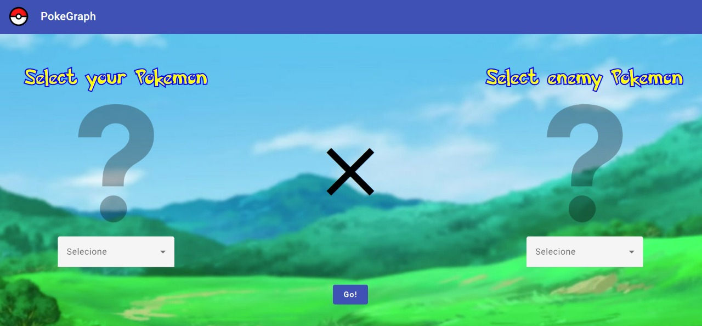
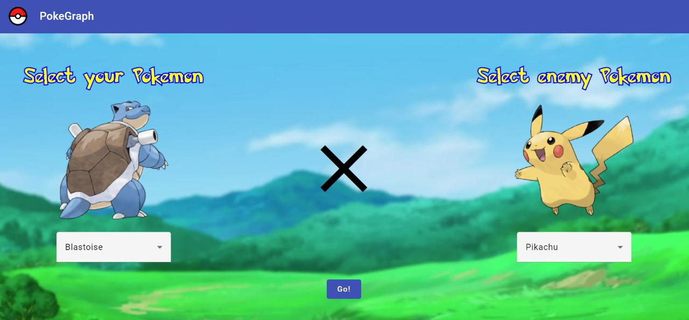
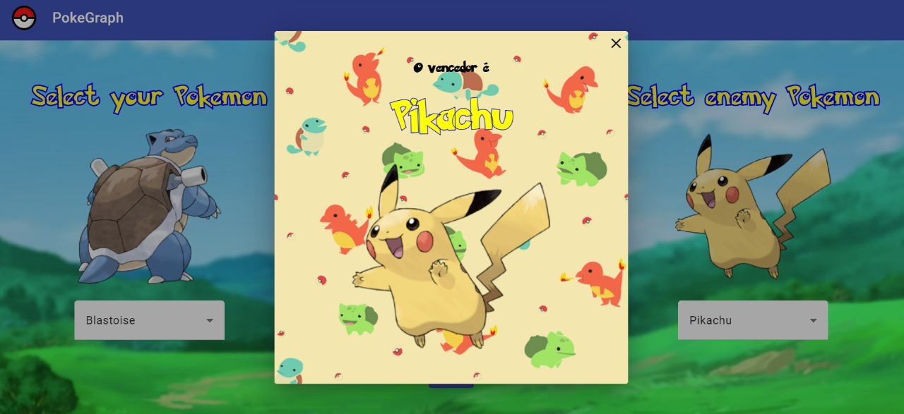

# PokeGraph

**Número da Lista**: Não se aplica 
**Conteúdo da Disciplina**: Grafos 1 

## Alunos
|Matrícula | Aluno |
| -- | -- |
| 19/0010606 | Artur de Sousa Vieira |
| 18/0145363 |  Yan Andrade de Sena  |

## Sobre 
O objetido do Pokegraph é apresentar uma interface direta e simples de utilizar, que tem a função de mostrar o resultado
da batalha entre dois Pokemons, se baseando no tipo deles. Para isso é utilizado a estrutuda de Grafos, que origina 
o nome do projeto:
Pokegraph!

## Screenshots

### Pagina inicial (Sem Seleção)

 

### Pagina inicial (Pokemons Selecionados)

 

### Modal de vitória

 

## Instalação 
**Linguagem**: Java 
**Framework**: Springboot 
Descreva os pré-requisitos para rodar o seu projeto e os comandos necessários.

## Uso 
Explique como usar seu projeto caso haja algum passo a passo após o comando de execução.

## Outros 

### Link Repositório Antigo
Em vista de problema na criação do git-hub na organização da disciplina,
segue o link para o [Repositório Antigo](https://github.com/yandrade1305/grafos1_pokegraph)

### Download Apresentação

Segue o Link para download da [Apresentação do projeto](assets-readme/apresentacao-pokegraph.mp4)
